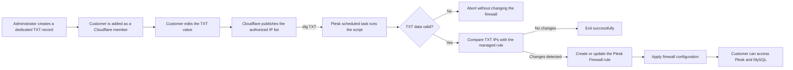

<div align="center">

# ☁️🔐 Cloudflare Pseudo-DDNS for Plesk Firewall


**A lightweight DDNS-like workflow that lets a customer manage the public IP addresses allowed through a Plesk Firewall rule by editing one Cloudflare TXT record.**

</div>

---

## 🎯 The problem this project solves

A customer may need remote access to services hosted on a Plesk server, such as:

```text
8443/tcp  → Plesk control panel
3306/tcp  → MySQL/MariaDB synchronization
```

Those services should not be exposed to the entire Internet, so access is restricted by source IP in the Plesk Firewall.

The problem is that many customers use an Internet connection with a **dynamic public IP address**. Whenever that address changes, the existing firewall rule becomes outdated and the customer loses access until an administrator manually adds the new IP.

This project removes that dependency on the server administrator.

The administrator creates a dedicated TXT record in Cloudflare and grants the customer access to the Cloudflare zone. From that point on, the customer only needs to edit the TXT value and add or remove the public IP addresses that should be allowed.

The Plesk server periodically reads that record and synchronizes a single firewall rule automatically.

---

## ☁️ Cloudflare as a DDNS-like control plane

This is not traditional DDNS in the strict sense of automatically updating an `A` or `AAAA` record from a router or local agent.

Instead, it **simulates the useful part of a DDNS workflow** for firewall authorization:

1. Cloudflare stores the current list of authorized public IP addresses.
2. The customer updates that list whenever their public IP changes.
3. The Plesk server polls the TXT record on a schedule.
4. The script detects changes and updates the firewall rule.
5. Access to the protected services is restored from the new IP.

In this design, the Cloudflare TXT record becomes the **source of truth** for the customer IP allowlist.

```text
Cloudflare TXT record = Customer-managed IP allowlist
Plesk scheduled task  = Synchronization mechanism
Plesk Firewall rule   = Enforcement layer
```

This provides a simple DDNS-like experience without giving the customer:

- SSH access to the server.
- Administrator access to Plesk.
- Direct access to the firewall configuration.
- A Cloudflare API token stored on their computer.
- The ability to modify unrelated server rules.

---

## 🧭 Intended workflow



### Administrator responsibilities

The administrator performs the initial setup:

1. Adds the customer as a member of the appropriate Cloudflare account or zone.
2. Grants only the DNS permissions required for that zone.
3. Creates the dedicated TXT record.
4. Installs the script on the Plesk server.
5. Chooses the firewall rule name and allowed service ports.
6. Creates a Plesk scheduled task that runs as `root`.

### Customer responsibilities

The customer does not manage the server or the firewall directly.

They only edit the content of the dedicated Cloudflare TXT record:

```text
80.25.14.100,83.40.55.20
```

To revoke an address, they remove it from the list. To authorize a new address, they add it.

### Script responsibilities

The script:

1. Resolves the TXT record.
2. Extracts the IPv4 addresses.
3. Validates and normalizes the list.
4. Reads the current Plesk Firewall configuration.
5. Creates or updates only the rule managed by the script.
6. Applies the firewall changes.
7. Writes the result to a log file.
8. Returns a proper exit code for Plesk scheduled tasks.

---

## ✨ Features

- ☁️ Uses a Cloudflare-hosted DNS TXT record as the customer-facing allowlist.
- 🔄 Provides a lightweight DDNS-like workflow for changing public IP addresses.
- 🔎 Queries the TXT record using `dig`.
- ✅ Validates every IPv4 address and port before modifying the firewall.
- 🧹 Removes duplicate IP addresses and normalizes the list.
- 🎯 Manages one Plesk Firewall rule using an exact rule-name match.
- 🔁 Creates the rule when it does not exist or updates it by ID when it already exists.
- 🧠 Applies changes only when the IPs, ports, action, or direction differ.
- 🔒 Prevents concurrent executions using `flock`.
- 📝 Writes activity to a configurable log file.
- 🧪 Includes a safe `--dry-run` mode.
- 🤫 Includes a `--quiet` mode for Plesk scheduled tasks and CRON.
- 🟢 Returns exit code `0` after a successful run, including when no update is required.
- 🛑 Leaves the existing firewall configuration untouched when DNS resolution or validation fails.

---

## ⚙️ Firewall behavior

The managed firewall rule uses:

```text
Direction: input
Action:    allow
Sources:   IPv4 addresses retrieved from the Cloudflare TXT record
Ports:     value supplied through --ports
```

For example:

```text
Rule name: DDNS - Customer Access
Sources:   80.25.14.100,83.40.55.20
Ports:     8443/tcp,3306/tcp
Direction: input
Action:    allow
```

> [!IMPORTANT]
> The script updates the **Plesk Firewall only**. It does not change MySQL/MariaDB users, grants, `bind-address`, or service configuration. Remote database access must also be allowed at the database layer.

> [!WARNING]
> A broader firewall rule that already allows the same ports from every source will override the intended restriction. Review the complete Plesk Firewall policy before relying on this rule as the only access control.

---

## 📋 Requirements

| Requirement | Details |
|---|---|
| Platform | Plesk for Linux |
| Privileges | Must run as `root` |
| Bash | Version `4.3` or later |
| Plesk | Firewall extension installed and working |
| DNS provider | Cloudflare in the intended deployment model |
| Commands | `dig`, `jq`, `flock`, `sort`, `paste`, `install` |

On Debian or Ubuntu:

```bash
apt update
apt install -y dnsutils jq util-linux coreutils
```

Quick dependency check:

```bash
command -v bash dig jq flock sort paste install plesk
```

---

## 📦 Installation

Install the script in a root-only location:

```bash
install -o root -g root -m 700 ddns /usr/local/sbin/ddns
```

Display the help panel:

```bash
/usr/local/sbin/ddns --help
```

---

## 🌐 Cloudflare TXT record setup

Create one dedicated TXT record in the same Cloudflare zone as the customer's domain.

Example:

| Field | Value |
|---|---|
| Type | `TXT` |
| Name | `ddns-<GUID>.example.com` |
| Content | `80.25.14.100,83.40.55.20` |
| TTL | A low or automatic value appropriate for the deployment |

The administrator creates the record once. Afterward, the customer only edits its content.

### Recommended naming

Use a dedicated hostname that clearly identifies its purpose but cannot be easily identified by performing subdomain bruteforcing/fuzzing or a similar offensive technique

To ensure the latter, we can simply access to an ***[Online GUID Generator](https://www.guidgenerator.com/)*** to generate a valid one and append it to the *ddns* string, such as follows

> [!IMPORTANT]
>
> ```bash
>  ddns-<GUID>.<DOMAIN>.<TLD>
> ```
>

<details>
<summary><strong>Example</strong></summary>

```text
ddns-3e7e5afd-0690-4c68-8af5-9be22f386824.domain.tld
```

</details>

Avoid using the zone apex or mixing this value with unrelated TXT records.

### Accepted content format

```text
IPv4,IPv4,IPv4
```


<details>
<summary><strong>Example</strong></summary>

```text
80.25.14.100,83.40.55.20,185.10.20.30
```

Spaces are also accepted:

```text
80.25.14.100, 83.40.55.20, 185.10.20.30
```

</details>

### Manual verification

From the Plesk server:

```bash
dig +short TXT ddns-access.example.com
```

**Expected output**

```text
"80.25.14.100,83.40.55.20"
```

### Current limitations

- IPv4 addresses only.
- Exactly one TXT response must be returned.
- CIDR ranges are not accepted inside the TXT record.
- An empty value causes a safe failure.
- Any invalid address causes the update to be rejected.
- TXT content is public DNS data and must never contain passwords, tokens, or secrets.

---

## 👤 Cloudflare access model

The customer should receive access only to the Cloudflare account or zone required for their domain, with the minimum permissions needed to edit DNS records.

The recommended separation of responsibilities is:

| Actor | Access |
|---|---|
| Administrator | Cloudflare setup, server, Plesk Firewall, scheduled task, logs |
| Customer | Edit the dedicated TXT record in the assigned Cloudflare zone |
| Script | Read public DNS and modify only the configured Plesk Firewall rule |

> [!TIP]
> The TXT record is intentionally simple enough for a non-technical customer: they only need to replace the old public IP with the new one or maintain a comma-separated list when several locations require access.

---

## 🚀 Usage

### Syntax

```bash
ddns -r <TXT_RECORD> [options]
```

### Basic execution

```bash
/usr/local/sbin/ddns \
  --record 'ddns-access.example.com'
```

Default values:

```text
Default ports:     8443/tcp,3306/tcp
Default rule name: DDNS TXT - ddns-access.example.com
Default log file:  /var/log/plesk-txt-firewall.log
```

### Full example

```bash
/usr/local/sbin/ddns \
  --record 'ddns-access.example.com' \
  --ports '8443/tcp,3306/tcp' \
  --name 'DDNS - Customer Access' \
  --log '/var/log/plesk-ddns-firewall-customer.log' \
  --quiet
```

The `--option=value` format is also supported:

```bash
/usr/local/sbin/ddns \
  --record='ddns-access.example.com' \
  --ports='8443/tcp,3306/tcp'
```

---

## 🧩 Available options

| Option | Description | Default value |
|---|---|---|
| `-r`, `--record <fqdn>` | Cloudflare TXT record containing the IPv4 allowlist. **Required**. | — |
| `-p`, `--ports <list>` | Comma-separated ports using `port/protocol`. | `8443/tcp,3306/tcp` |
| `-n`, `--name <name>` | Exact name of the managed Plesk Firewall rule. | `DDNS TXT - <record>` |
| `-l`, `--log <path>` | Activity log file. | `/var/log/plesk-txt-firewall.log` |
| `-q`, `--quiet` | Suppresses informational output on `stdout`. | Disabled |
| `--dry-run` | Shows the required change without applying it. | Disabled |
| `-h`, `--help` | Displays the help panel. | — |

Ports must use this format:

```text
8443/tcp,3306/tcp,53/udp
```

Each port must be between `1` and `65535`, and the protocol must be `tcp` or `udp`.

---

## 🧪 Safe deployment test

Before enabling periodic execution, run:

```bash
/usr/local/sbin/ddns \
  --record 'ddns-access.example.com' \
  --ports '8443/tcp,3306/tcp' \
  --name 'DDNS - Customer Access' \
  --dry-run
```

The script displays the change it would perform without creating, updating, or applying firewall rules.

After reviewing the output, run it once without `--dry-run` and confirm that the expected source addresses and ports appear in the Plesk Firewall rule.

---

## ⏱️ Plesk scheduled task

In Plesk, go to:

```text
Tools & Settings
└── Scheduled Tasks
    └── Add Task
```

Recommended configuration:

| Setting | Recommended value |
|---|---|
| Task type | Run a command |
| User | `root` |
| Frequency | Every 5 minutes |
| Notifications | Errors only, depending on preference |

Command:

```bash
/usr/local/sbin/ddns --record 'ddns-<GUID>.<DOMAIN>.<TLD>' --ports '<PORT>/tcp,<PORT>/tcp' --name 'DDNS - Customer Access' --log '/var/log/plesk-ddns-firewall-<CUSTOMER>.log' --quiet
```

<details>
<summary><strong>Example command</strong></summary>

```bash
/usr/local/sbin/ddns --record 'ddns-3e7e5afd-0690-4c68-8af5-9be22f386824.domain.com' --ports '8443/tcp,8443/udp,3306/tcp' --name 'DDNS - ACME S.A' --log '/var/log/plesk-ddns-firewall-ACME.log' --quiet
```

</details>

Equivalent CRON entry:

```cron
*/5 * * * * /usr/local/sbin/ddns --record 'ddns-<GUID>.<DOMAIN>.<TLD>' --ports '<PORT>/tcp,<PORT>/tcp' --name 'DDNS - Customer Access' --log '/var/log/plesk-ddns-firewall-<CUSTOMER>.log' --quiet
```

<details>
<summary><strong>Example CRON entry</strong></summary>

```cron
*/5 * * * * /usr/local/sbin/ddns --record 'ddns-3e7e5afd-0690-4c68-8af5-9be22f386824.domain.com' --ports '8443/tcp,8443/udp,3306/tcp' --name 'DDNS - ACME S.A' --log '/var/log/plesk-ddns-firewall-ACME.log' --quiet
```

</details>

> [!TIP]
> **`--quiet`** suppresses routine output while the script continues writing activity to the configured log file. Successful executions return **`0`**, allowing Plesk to display a green check mark.

---

## ⏳ Expected update delay

A firewall update is not necessarily instantaneous.

The total delay depends on:

```text
DNS publication and resolver cache
+ scheduled task interval
+ Plesk Firewall apply time
```

With a low DNS TTL and a task that runs every five minutes, access is normally restored shortly after the TXT record is updated.

The customer should understand that editing the record starts the synchronization process; it does not directly modify the firewall in real time.

---

## 🟢 Exit codes

| Code | Meaning |
|---:|---|
| `0` | Successful execution, no changes required, or another instance was already running. |
| `1` | Operational error involving DNS, dependencies, permissions, Plesk, logging, or firewall application. |
| `99` | Invalid arguments or incorrect CLI usage. |

Check the result manually:

```bash
/usr/local/sbin/ddns --record 'ddns-<GUID>.<DOMAIN>.<TLD>' --quiet
echo $?
```

A successful execution returns:

```text
0
```

---

## 📝 Activity log

Default log file:

```text
/var/log/plesk-txt-firewall.log
```

Example:

```text
2026-06-29 09:10:02 - Updating firewall rule ID 4323: DDNS - Customer Access
2026-06-29 09:10:02 - Allowed IPv4 addresses: 80.25.14.100,83.40.55.20
2026-06-29 09:10:02 - Allowed ports: 8443/tcp,3306/tcp
2026-06-29 09:10:06 - Plesk Firewall changes applied successfully
```

When the log file does not exist, it is created with `0600` permissions.

---

## 🔐 Security model

The design deliberately separates the customer-facing control plane from the server enforcement layer.

The customer controls only the IP list published in DNS. The script decides how that list is validated and applies it only to the predefined firewall rule and ports.

> [!WARNING]
> Anyone who can edit the dedicated TXT record can authorize IP addresses in the firewall rule managed by this script.

Recommendations:

1. Enable MFA on the customer's Cloudflare account.
2. Grant the minimum Cloudflare permissions required for the relevant zone.
3. Use a dedicated TXT hostname for this workflow.
4. Do not grant the customer server, SSH, or Plesk administrator access for this purpose.
5. Keep the allowed ports explicitly defined in the scheduled task.
6. Protect the script and its log file with root-only permissions.
7. Test the first deployment with `--dry-run` and keep an alternative administrative session available.
8. Verify that no broader firewall rule exposes Plesk or MySQL globally.
9. Restrict MySQL/MariaDB independently through database configuration and user grants.
10. Never store secrets in the TXT record.

The script does not remove or alter unrelated Plesk Firewall rules. It creates or updates only the rule whose exact name is supplied through `--name`.

---

## 🛠️ Troubleshooting

<details>
<summary><strong>The customer changed the TXT record, but access is still blocked</strong></summary>

Check the published value from the Plesk server:

```bash
dig +short TXT ddns-access.example.com
```

Then run the script manually and inspect the exit code:

```bash
/usr/local/sbin/ddns --record 'ddns-access.example.com'
echo $?
```

Also consider the DNS TTL, resolver cache, and scheduled task interval.

</details>

<details>
<summary><strong>The script reports that the TXT record returned no data</strong></summary>

Test DNS resolution directly:

```bash
dig +time=3 +tries=2 +short TXT ddns-access.example.com
```

Verify the record name, Cloudflare zone, value, and DNS propagation.

</details>

<details>
<summary><strong>Multiple TXT responses are returned</strong></summary>

The script requires exactly one TXT response to prevent unrelated values from being merged. Use a dedicated hostname and remove duplicate TXT records with the same name.

</details>

<details>
<summary><strong>The rule is updated, but the service is still unreachable</strong></summary>

Check the firewall and listening services:

```bash
plesk ext firewall --list-json | jq
ss -lntup
```

For MySQL/MariaDB, also verify `bind-address`, the database user's permitted hosts, service availability, and any additional upstream firewall.

</details>

<details>
<summary><strong>Plesk marks the task with a warning</strong></summary>

Run the exact command manually and inspect its exit code:

```bash
/usr/local/sbin/ddns --record 'ddns-access.example.com' --quiet
echo $?
```

A successful execution must return `0`. Errors are written to `stderr` and, when possible, to the configured log file.

</details>

<details>
<summary><strong>Another instance is already running</strong></summary>

The script uses:

```text
/run/lock/plesk-txt-firewall.lock
```

A second instance exits safely with code `0`, preventing concurrent firewall modifications.

</details>

---

## 📌 Real-world example

```text
Customer's public IP changes
        │
        ├── Customer signs in to Cloudflare
        ├── Opens the predefined TXT record
        └── Replaces the old IP with the new public IP
                │
                ▼
Cloudflare publishes the updated TXT value
                │
                ▼
Plesk runs the scheduled task as root
                │
                ├── Resolves the TXT record
                ├── Validates the IP list
                ├── Detects the difference
                ├── Updates the managed firewall rule
                └── Applies the new configuration
                        │
                        ▼
Customer can access Plesk and MySQL from the new IP
```

No administrator intervention is required after the initial deployment.

---

## 🧠 Why use TXT instead of an A record?

An `A` record normally maps a hostname to one IPv4 address. This project uses TXT because the firewall may need to authorize several independent addresses at the same time.

A TXT value can represent a simple list:

```text
80.25.14.100,83.40.55.20,185.10.20.30
```

This makes it suitable for:

- Several customer offices.
- A home connection plus an office connection.
- Temporary technician access.
- Adding and removing authorized addresses without changing the script.

The TXT record is not used to route application traffic. It is used only as a public, customer-editable configuration source for the firewall synchronizer.

---

<div align="center">

### ☁️ Cloudflare TXT → 🔎 Validation → 🔥 Plesk Firewall → ✅ Customer Access

<sub>A simple, auditable, and DDNS-like method for customer-managed IP allowlisting on Plesk servers.</sub>

</div>
