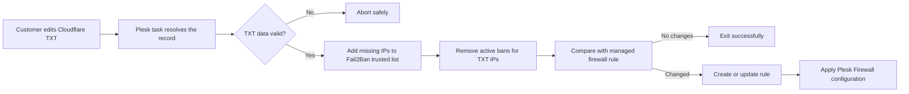

<div align="center">

# ☁️🔐 Cloudflare TXT DDNS Sync: Plesk Firewall + Fail2Ban


**A lightweight pseudo-DDNS workflow that synchronizes both Plesk Firewall access and Fail2Ban trust from a single Cloudflare TXT record.**

</div>

---

## 🎯 Purpose

Plesk and MySQL/MariaDB should not be exposed to every source address. However, customers with dynamic public IPs lose access whenever their address changes.

This project uses one Cloudflare TXT record as the source of truth for **two synchronized security layers**:

| Layer | Synchronization performed |
|---|---|
| **Plesk Firewall** | Creates or updates the managed allow rule for the configured ports. |
| **Fail2Ban** | Adds TXT addresses to the trusted list and removes any active ban affecting them. |

```text
Cloudflare TXT  →  validation  →  Fail2Ban sync  →  Plesk Firewall sync
```

The administrator performs the initial setup. After that, the customer only maintains the IP list in Cloudflare—without SSH, Plesk administrator, or direct firewall access.

---

## 🧭 How it works



### Responsibilities

| Actor | Responsibility |
|---|---|
| Administrator | Creates the TXT record, grants limited Cloudflare access, installs the script, defines ports, and schedules execution as `root`. |
| Customer | Maintains the comma-separated public IP list in Cloudflare. |
| Script | Validates the TXT value, synchronizes Fail2Ban, updates one exact firewall rule, logs the result, and returns a Plesk-friendly exit code. |

---

## ✨ Main features

- Uses one Cloudflare TXT record as the source of truth.
- Accepts multiple comma-separated IPv4 addresses.
- Rejects empty, malformed, or ambiguous TXT responses.
- Removes duplicate addresses and normalizes the result.
- Adds missing TXT addresses to Plesk's Fail2Ban trusted list.
- Removes any active Fail2Ban ban affecting a TXT address.
- Creates or updates one firewall rule by exact name.
- Applies firewall changes only when required.
- Supports `--dry-run`, `--quiet`, custom logs, and `--option=value` syntax.
- Prevents concurrent runs with `flock`.
- Returns `0` after a successful run, including when nothing changed.

---

## 🔥 Firewall and Fail2Ban behavior

### Plesk Firewall

The managed rule always uses:

```text
Direction: input
Action:    allow
Sources:   IPv4 addresses from the TXT record
Ports:     value supplied through --ports
```

Example:

```text
Rule:      DDNS - Customer Access
Sources:   80.25.14.100,83.40.55.20
Ports:     8443/tcp,3306/tcp
```

### Fail2Ban

For every valid TXT address, the script:

1. Adds it to the trusted list when it is not already present.
2. Checks the active ban list.
3. Removes an existing ban for that address.

The order is intentional: **trust first, unban second**. Adding an address to the trusted list helps prevent future bans, but does not reliably remove a ban that is already active.

> [!IMPORTANT]
> IPs removed from the TXT record are removed from the managed firewall rule, but they are **not automatically removed from Fail2Ban's global trusted list**. This avoids deleting entries created manually or used by another integration.

> [!WARNING]
> A trusted Fail2Ban address is exempt globally, not only for Plesk or MySQL. Only publish customer-controlled IPs that should genuinely be trusted.

> [!IMPORTANT]
> The script does not change MySQL/MariaDB users, grants, `bind-address`, or service configuration. Database access must also be allowed at the database layer.

---

## 📋 Requirements

| Requirement | Details |
|---|---|
| Platform | Plesk for Linux |
| Privileges | `root` |
| Bash | `4.3` or later |
| Plesk components | Firewall extension and Fail2Ban enabled |
| Commands | `dig`, `jq`, `flock`, `sort`, `paste`, `install` |

Debian/Ubuntu dependencies:

```bash
apt update
apt install -y dnsutils jq util-linux coreutils
```

Quick check:

```bash
command -v bash dig jq flock sort paste install plesk
plesk bin ip_ban --trusted
plesk ext firewall --list-json >/dev/null
```

---

## 🌐 Cloudflare TXT setup

Create one dedicated TXT record inside the customer's Cloudflare zone.

| Field | Example |
|---|---|
| Type | `TXT` |
| Name | `ddns-<GUID>.example.com` |
| Content | `80.25.14.100,83.40.55.20` |
| TTL | Auto or a suitably low value |

A GUID-based name makes accidental discovery less likely:

```text
ddns-3e7e5afd-0690-4c68-8af5-9be22f386824.example.com
```

Accepted content:

```text
80.25.14.100,83.40.55.20,185.10.20.30
```

Spaces are accepted:

```text
80.25.14.100, 83.40.55.20, 185.10.20.30
```

Manual verification:

```bash
dig +short TXT ddns-3e7e5afd-0690-4c68-8af5-9be22f386824.example.com
```

Expected output:

```text
"80.25.14.100,83.40.55.20"
```

> [!NOTE]
> TXT records are public DNS data. Never store passwords, tokens, or other secrets in them.

---

## 📦 Installation

```bash
install -o root -g root -m 700 ddns /usr/local/sbin/ddns
```

Display the help panel:

```bash
/usr/local/sbin/ddns --help
```

---

## 🚀 Usage

### Basic syntax

```bash
ddns -r <TXT_RECORD> [options]
```

### Full example

```bash
/usr/local/sbin/ddns \
  --record 'ddns-3e7e5afd-0690-4c68-8af5-9be22f386824.example.com' \
  --ports '8443/tcp,3306/tcp' \
  --name 'DDNS - Customer Access' \
  --log '/var/log/plesk-ddns-firewall-customer.log' \
  --quiet
```

### Options

| Option | Description | Default |
|---|---|---|
| `-r`, `--record <fqdn>` | TXT record containing the IPv4 allowlist. **Required.** | — |
| `-p`, `--ports <list>` | Comma-separated `port/protocol` values. | `8443/tcp,3306/tcp` |
| `-n`, `--name <name>` | Exact managed firewall rule name. | `DDNS TXT - <record>` |
| `-l`, `--log <path>` | Activity log file. | `/var/log/plesk-txt-firewall.log` |
| `-q`, `--quiet` | Suppress routine `stdout` output. | Disabled |
| `--dry-run` | Show Fail2Ban and firewall actions without applying them. | Disabled |
| `-h`, `--help` | Show help. | — |

Both forms are accepted:

```bash
--record example.com
--record=example.com
```

---

## 🧪 Safe deployment test

Run a dry test first:

```bash
/usr/local/sbin/ddns \
  --record 'ddns-3e7e5afd-0690-4c68-8af5-9be22f386824.example.com' \
  --ports '8443/tcp,3306/tcp' \
  --name 'DDNS - Customer Access' \
  --dry-run
```

`--dry-run` still resolves and validates DNS and reads the current Plesk state, but does not modify Fail2Ban or the firewall.

Then run the same command without `--dry-run` and verify:

```bash
plesk bin ip_ban --trusted
plesk bin ip_ban --banned
plesk ext firewall --list-json | jq
```

---

## ⏱️ Plesk scheduled task

In Plesk:

```text
Tools & Settings
└── Scheduled Tasks
    └── Add Task
```

Recommended values:

| Setting | Value |
|---|---|
| Task type | Run a command |
| User | `root` |
| Frequency | Every 5 minutes |
| Notifications | Errors only |

Command:

```bash
/usr/local/sbin/ddns --record 'ddns-<GUID>.<DOMAIN>.<TLD>' --ports '8443/tcp,3306/tcp' --name 'DDNS - Customer Access' --log '/var/log/plesk-ddns-firewall-customer.log' --quiet
```

Equivalent CRON entry:

```cron
*/5 * * * * /usr/local/sbin/ddns --record 'ddns-<GUID>.<DOMAIN>.<TLD>' --ports '8443/tcp,3306/tcp' --name 'DDNS - Customer Access' --log '/var/log/plesk-ddns-firewall-customer.log' --quiet
```

> [!TIP]
> `--quiet` hides routine console output while preserving the log. Successful executions return `0`, allowing Plesk to show a green check mark.

---

## ⏳ Update delay

Changes are not instant. The total delay is approximately:

```text
DNS publication/cache + scheduled task interval + Plesk apply time
```

With a low TTL and a five-minute task, access should normally be restored shortly after the TXT update.

---

## 📝 Logs and exit codes

Default log:

```text
/var/log/plesk-txt-firewall.log
```

Example:

```text
2026-06-30 09:10:01 - Fail2Ban trusted IPv4 addresses added: 80.25.14.100
2026-06-30 09:10:02 - Fail2Ban active ban removed for IPv4 address: 80.25.14.100
2026-06-30 09:10:02 - Updating firewall rule ID 4323: DDNS - Customer Access
2026-06-30 09:10:06 - Plesk Firewall changes applied successfully
```

| Code | Meaning |
|---:|---|
| `0` | Success, no change required, or another instance is already running. |
| `1` | DNS, dependency, permission, logging, Fail2Ban, Plesk, or firewall error. |
| `99` | Invalid arguments or CLI usage. |

Check manually:

```bash
/usr/local/sbin/ddns --record 'ddns-<GUID>.<DOMAIN>.<TLD>' --quiet
echo $?
```

---

## 🔐 Security notes

- Grant the customer only the Cloudflare DNS permissions required for their zone.
- Enable MFA on the customer's Cloudflare account.
- Keep the allowed ports fixed in the scheduled task; the TXT controls only source IPs.
- Protect the script and log files with root-only permissions.
- Verify that no broader firewall rule exposes the same ports globally.
- Use `--dry-run` before the first deployment.
- Never store secrets in the TXT record.

> [!WARNING]
> Anyone who can edit the TXT record can authorize an IP in the managed firewall rule and add it to Fail2Ban's trusted list.

---

## ⚠️ Current limitations

- IPv4 only.
- Exactly one TXT answer is accepted.
- CIDR ranges are not supported inside the TXT value.
- Empty or invalid items abort the run safely.
- Removed TXT addresses remain in Fail2Ban's trusted list until removed manually.
- The script manages only one exact Plesk Firewall rule per execution.
- It does not configure the application or database layer.

To remove an obsolete trusted IP manually:

```bash
plesk bin ip_ban --remove-trusted 80.25.14.100
```

---

## 🛠️ Troubleshooting

<details>
<summary><strong>The TXT record changed, but access is still blocked</strong></summary>

```bash
dig +short TXT ddns-<GUID>.<DOMAIN>.<TLD>
/usr/local/sbin/ddns --record 'ddns-<GUID>.<DOMAIN>.<TLD>'
echo $?
```

Also check DNS caching, the task interval, the listening service, and database-level permissions.

</details>

<details>
<summary><strong>The address is still shown as banned</strong></summary>

```bash
plesk bin ip_ban --banned
plesk bin ip_ban --trusted
```

Run the script manually without `--dry-run` and inspect its log. The address should first be trusted and then unbanned.

</details>

<details>
<summary><strong>The firewall rule changed, but the service is unreachable</strong></summary>

```bash
plesk ext firewall --list-json | jq
ss -lntup
```

For MySQL/MariaDB, also verify `bind-address`, user host permissions, service status, and upstream firewalls.

</details>

<details>
<summary><strong>Plesk marks the task with a warning</strong></summary>

Run the exact command manually and inspect its status:

```bash
/usr/local/sbin/ddns --record 'ddns-<GUID>.<DOMAIN>.<TLD>' --quiet
echo $?
```

A successful run must return `0`.

</details>

<details>
<summary><strong>An old IP remains trusted after being removed from TXT</strong></summary>

This is expected by design. Remove it manually only after confirming that it is not needed elsewhere:

```bash
plesk bin ip_ban --remove-trusted 80.25.14.100
```

</details>

---

## 🧠 Why TXT instead of an A record?

An `A` record represents one IPv4 address. A TXT value can hold several independent addresses, making it suitable for multiple offices, home and office access, or temporary technician access.

The TXT record does not route traffic. It is only a public configuration source for the synchronizer.

---

<div align="center">

### ☁️ Cloudflare TXT → 🛡️ Fail2Ban Sync + 🔥 Plesk Firewall Sync → ✅ Customer Access

<sub>One customer-managed TXT allowlist, synchronized with both Plesk Firewall and Fail2Ban.</sub>

</div>
